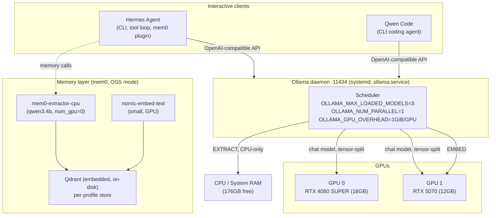

# 01 — System Architecture

The stack this whole saga lives in: one Ollama daemon serving two GPUs,
Hermes Agent as the interactive driver, and mem0 riding alongside it for
persistent memory. Everything shown here talks to the *same* Ollama daemon
on `:11434` — there is deliberately no second daemon anymore (see
[diagram 07](07-catch22s.md) and the SESSION.md writeup on the stray
`ollama-gpu1.service`).

**Why this shape:** the chat model needs GPU throughput, the embedder is
small enough to live on GPU for free, and the extraction model was
deliberately pinned to CPU/RAM (`num_gpu 0`) so it can never compete with
the chat model for VRAM — see [diagram 05](05-mem0-memory-pipeline.md).
