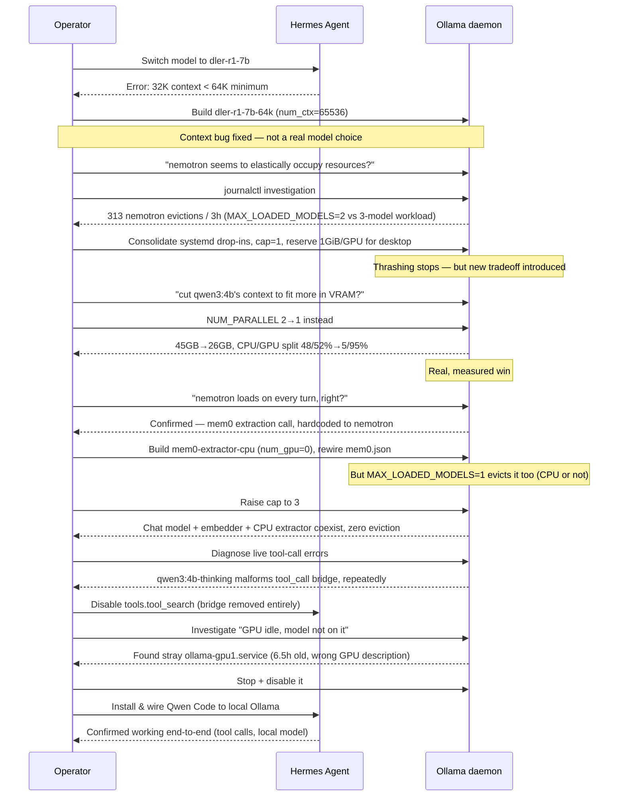

# 02 — What We Did (Timeline)

*Dark/neon render ([Graphviz](https://graphviz.org)): [SVG](graphviz/svg/02-what-we-did-timeline.svg) · [PNG](graphviz/png/02-what-we-did-timeline.png) · [DOT source](graphviz/02-what-we-did-timeline.dot)*

One session, one long chain of "fix this → notice that → fix that too."
Every arrow below is a real cause-and-effect link, not just chronology.

