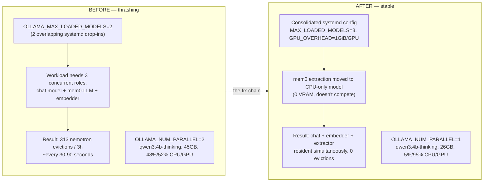

# 04 — GPU Scheduling: Before vs. After

Two separate measured comparisons from this session, shown side by side.

**The numbers that matter:**

| Metric | Before | After |
|---|---|---|
| nemotron evictions (3h window) | 313 | 0 |
| `nomic-embed-text` evictions (3h) | 256 | 0 |
| qwen3:4b-thinking reported size | 45 GB | 26 GB |
| qwen3:4b-thinking CPU/GPU split | 48% / 52% | 5% / 95% |
| Free VRAM per GPU at idle | ~2GB | ~1-1.6GB (reserved on purpose) |
