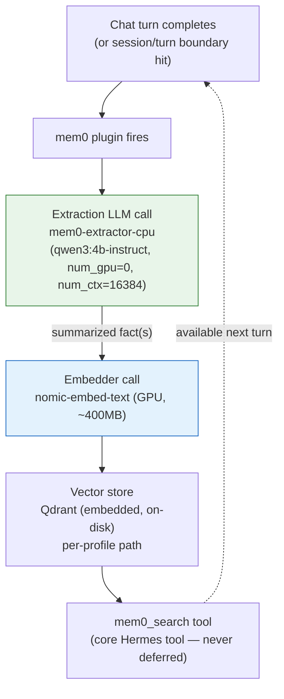

# 05 — mem0 Memory Pipeline

*Dark/neon render ([Graphviz](https://graphviz.org)): [SVG](graphviz/svg/05-mem0-memory-pipeline.svg) · [PNG](graphviz/png/05-mem0-memory-pipeline.png) · [DOT source](graphviz/05-mem0-memory-pipeline.dot)*

The path a single memory-relevant turn takes, end to end, after the fix.
Before the fix, the "Extraction LLM" box below was `nemotron-3.5-lightning:1m`
(33GB, GPU) — which is what caused all the eviction thrashing documented in
[diagram 04](04-gpu-scheduling-before-after.md).

**Why the extraction model is CPU-only, not just "small":** even a small
GPU-resident model still competes for the single-runner-slot cap
(`OLLAMA_MAX_LOADED_MODELS`) with the chat model — see
[diagram 07](07-catch22s.md). Pinning it to CPU/RAM (176GB free on this
machine) makes it structurally incapable of contending for VRAM, at the
cost of building a small derived Ollama tag instead of reusing a stock one.
