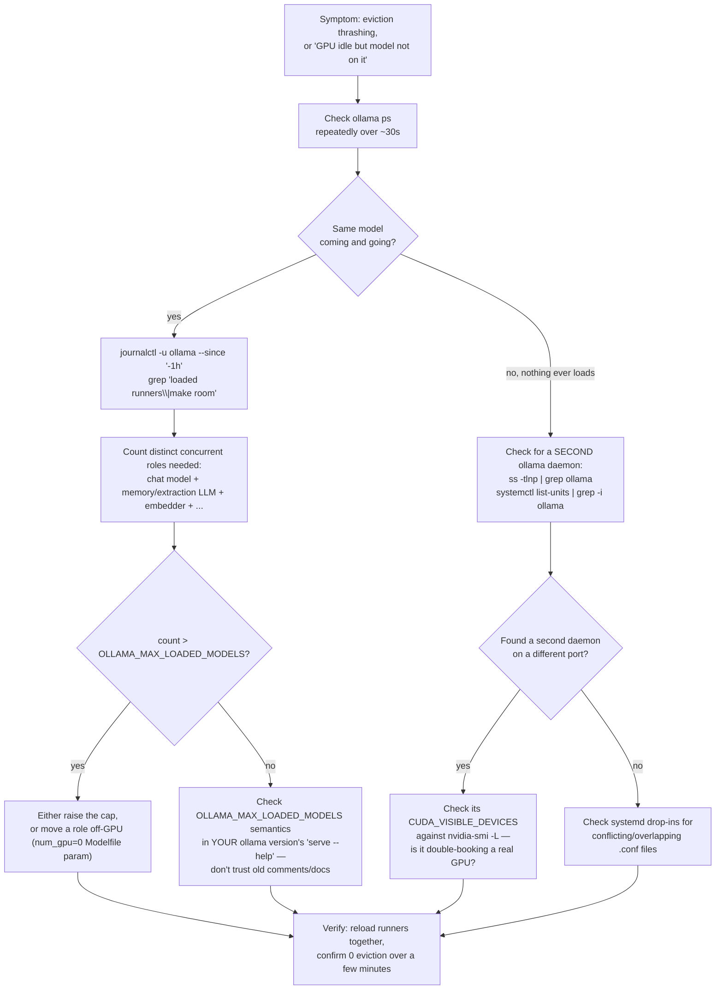

# 06 — How To: Diagnose and Fix This on Your Own Box


*Dark/neon render ([Graphviz](https://graphviz.org)): [SVG](graphviz/svg/06-howto-reproduce.svg) · [PNG](graphviz/png/06-howto-reproduce.png) · [DOT source](graphviz/06-howto-reproduce.dot)*

A generic checklist, not tied to any specific hostname or model — follow
this if `ollama ps` looks wrong or a model seems to load-then-vanish.



**Concrete commands used throughout this session:**
```bash
ollama ps
journalctl -u ollama --since "-3 hours" --no-pager | grep -E 'loaded runners|make room'
journalctl -u ollama --since "-3 hours" --no-pager | grep -oE "runner.name=registry.ollama.ai/library/[^ ]+" | sort | uniq -c | sort -rn
ss -tlnp | grep -i ollama
systemctl list-units --type=service | grep -i ollama
nvidia-smi -L
cat /etc/systemd/system/ollama.service.d/*.conf
```
