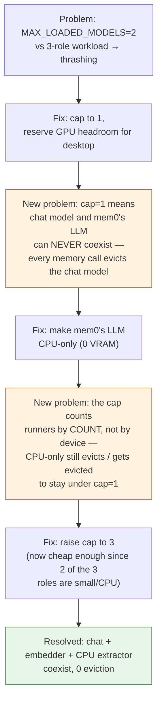

# 07 — Catch-22s

*Dark/neon render ([Graphviz](https://graphviz.org)): [SVG](graphviz/svg/07-catch22s.svg) · [PNG](graphviz/png/07-catch22s.png) · [DOT source](graphviz/07-catch22s.dot)*

Every fix in this session created a new, narrower problem before things
actually settled. This is the loop.

**The general shape of the trap:** a resource cap meant to solve contention
between the "expensive, important" tenant (chat model) and an "external"
concern (desktop GPU use) doesn't know about a *third* tenant (memory
extraction) until it collides with it — and the naive fix for that
collision (make the third tenant cheap) doesn't actually escape the cap
unless the cap itself understands *why* something is cheap.
