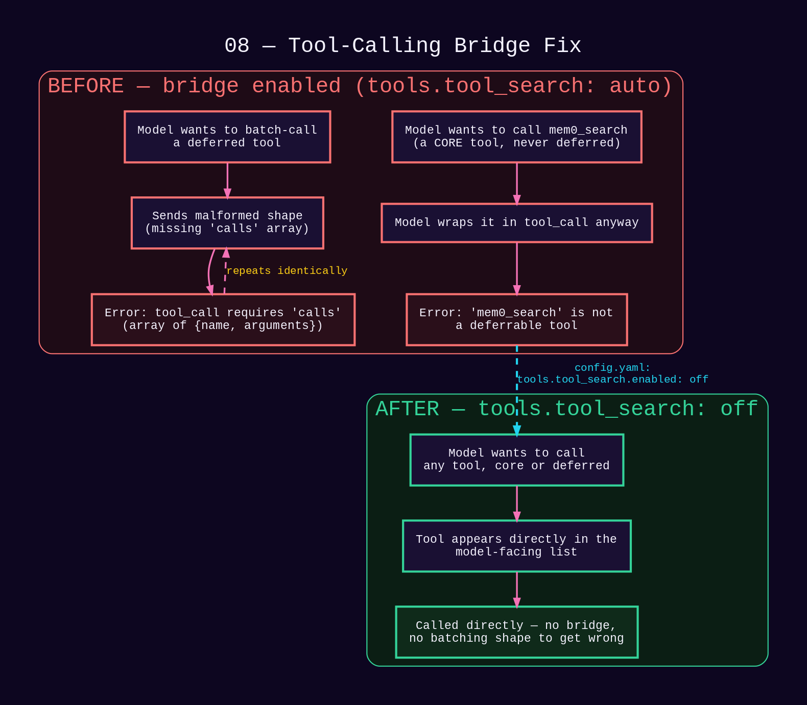
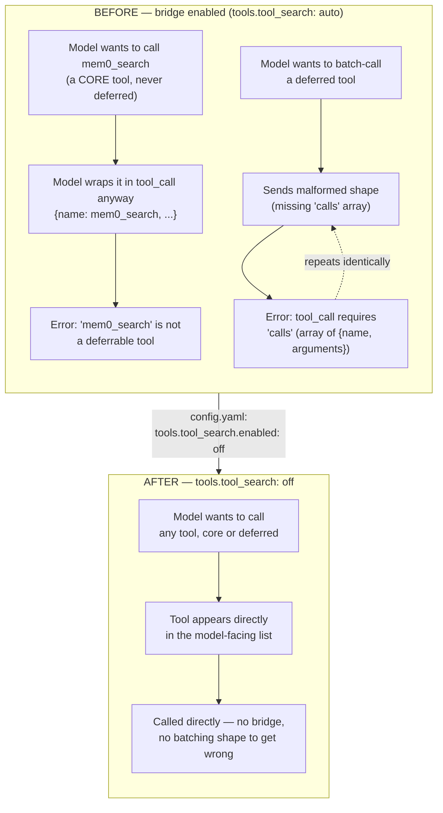

# 08 — Tool-Calling Bridge Fix

*Dark/neon render ([Graphviz](https://graphviz.org)): [SVG](graphviz/svg/08-tool-calling-bridge-fix.svg) · [PNG](graphviz/png/08-tool-calling-bridge-fix.png) · [DOT source](graphviz/08-tool-calling-bridge-fix.dot)*

Hermes Agent defers non-core tools behind a batching "bridge" tool by
default. Small local models kept malforming it — here's the shape of the
problem and the fix.

**Tradeoff accepted:** deferred/MCP tools now all appear eagerly in the
tool schema instead of being paged in on demand — a larger prompt footprint
if a big MCP toolset is ever added, acceptable at this context size.
