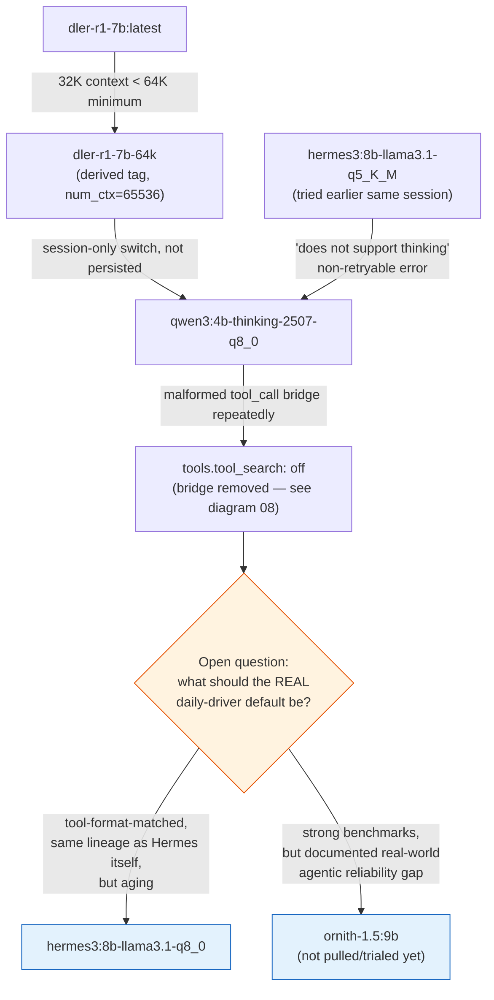

# 10 — Model-Choice Decision Tree

*Dark/neon render ([Graphviz](https://graphviz.org)): [SVG](graphviz/svg/10-model-choice-decision-tree.svg) · [PNG](graphviz/png/10-model-choice-decision-tree.png) · [DOT source](graphviz/10-model-choice-decision-tree.dot)*

The chat model changed several times this session, each for a concrete,
diagnosable reason — not just preference. This is that chain, and where it
currently dead-ends (deliberately unresolved).

**Recommendation on record:** don't swap to Ornith on benchmark numbers
alone — trial it in a sandboxed profile against real logged tasks first,
since the one hands-on report available shows it failing on exactly the
open-ended, multi-step tool-calling shape this workload is made of.
