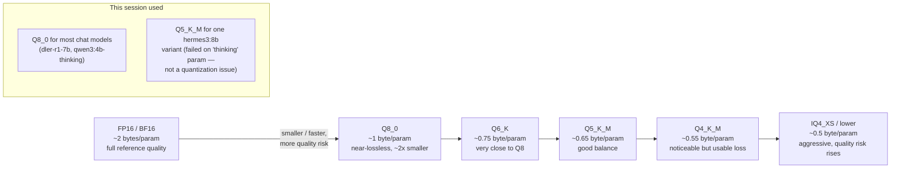

# 11 — Quantization Formats & Tradeoffs

*Dark/neon render ([Graphviz](https://graphviz.org)): [SVG](graphviz/svg/11-quantization-tradeoffs.svg) · [PNG](graphviz/png/11-quantization-tradeoffs.png) · [DOT source](graphviz/11-quantization-tradeoffs.dot)*

Every model tag mentioned in the main writeup (`q8_0`, `q5_K_M`, `q4_K_M`, ...)
is a point on this spectrum. This diagram is a general reference for what
those suffixes actually trade off — it's not specific to any one model here.

**The rule of thumb:** Q8_0 is close enough to full precision that it's a
safe default when VRAM allows. Below Q5, quality loss becomes model- and
task-dependent — worth actually testing on your workload rather than
assuming a smaller number is "fine."
