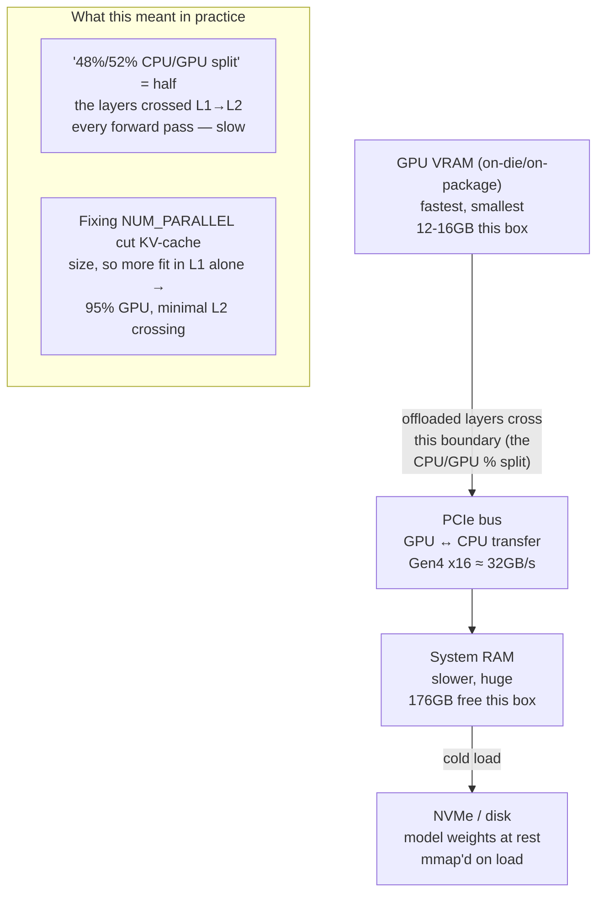

# 12 — GPU Memory Hierarchy

*Dark/neon render ([Graphviz](https://graphviz.org)): [SVG](graphviz/svg/12-gpu-memory-hierarchy.svg) · [PNG](graphviz/png/12-gpu-memory-hierarchy.png) · [DOT source](graphviz/12-gpu-memory-hierarchy.dot)*

The "CPU/GPU split" percentage you see in `ollama ps` is really a statement
about how many layers crossed which boundary below. This is the general
picture; [diagram 04](../04-gpu-scheduling-before-after.md) has this
session's actual before/after numbers.

**Why this matters practically:** every layer that doesn't fit in VRAM has
to shuttle activations across PCIe on every forward pass. That's not a
fixed one-time cost — it's paid per token generated, which is exactly why
the CPU/GPU split percentage correlates so directly with perceived speed.
