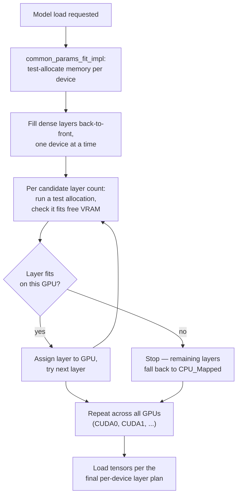

# 13 — Ollama's Layer-Fitting Scheduler

*Dark/neon render ([Graphviz](https://graphviz.org)): [SVG](graphviz/svg/13-ollama-scheduler-internals.svg) · [PNG](graphviz/png/13-ollama-scheduler-internals.png) · [DOT source](graphviz/13-ollama-scheduler-internals.dot)*

This is what's actually happening inside the `common_params_fit_impl` log
lines this session's `journalctl` output was full of — the per-layer test
allocation loop that decides GPU vs. CPU placement for every layer, on
every model load.

**Why it matters for capacity planning:** this fit calculation runs *fresh
on every load*, not once. Anything that changes available VRAM between
loads (another model resident, desktop apps, the `OLLAMA_GPU_OVERHEAD`
reservation) changes the outcome — which is exactly why the eviction
thrashing documented in the main writeup caused such wildly inconsistent
CPU/GPU splits load to load.
