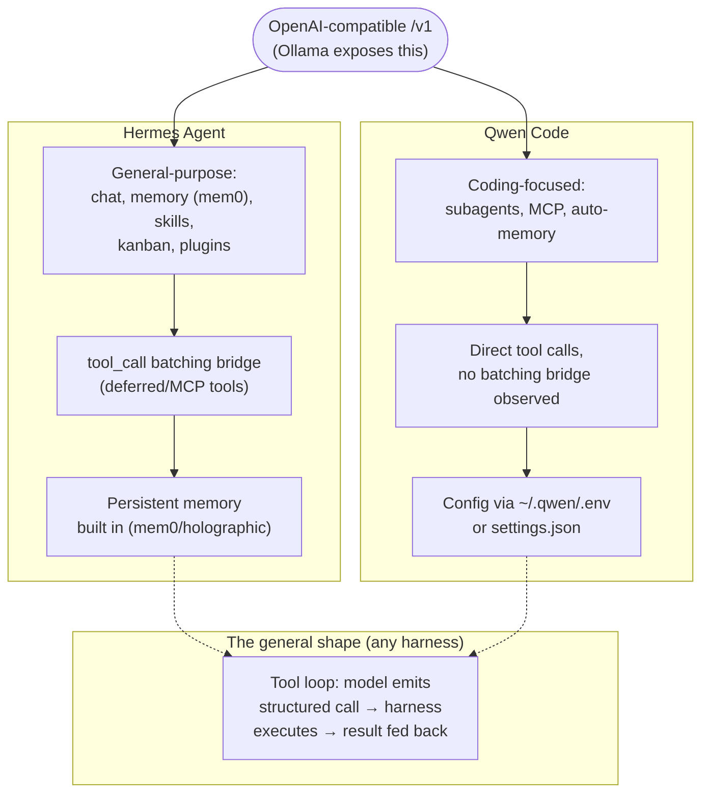

# 14 — Local Agent Harness Comparison

*Dark/neon render ([Graphviz](https://graphviz.org)): [SVG](graphviz/svg/14-agent-harness-comparison.svg) · [PNG](graphviz/png/14-agent-harness-comparison.png) · [DOT source](graphviz/14-agent-harness-comparison.dot)*

Both harnesses used this session — Hermes Agent (the primary driver
throughout) and Qwen Code (installed near the end) — sit on top of the same
Ollama OpenAI-compatible endpoint but structure their tool-calling
differently underneath.

**The concrete difference that bit this session:** Hermes's deferred-tool
bridge adds an indirection layer (`tool_call{calls:[...]}`) that small
models kept malforming — see [diagram 08](../08-tool-calling-bridge-fix.md).
Qwen Code's more direct tool-call path never hit that failure mode in the
brief comparison run here, though it hasn't been stress-tested the way
Hermes has across this whole session.
