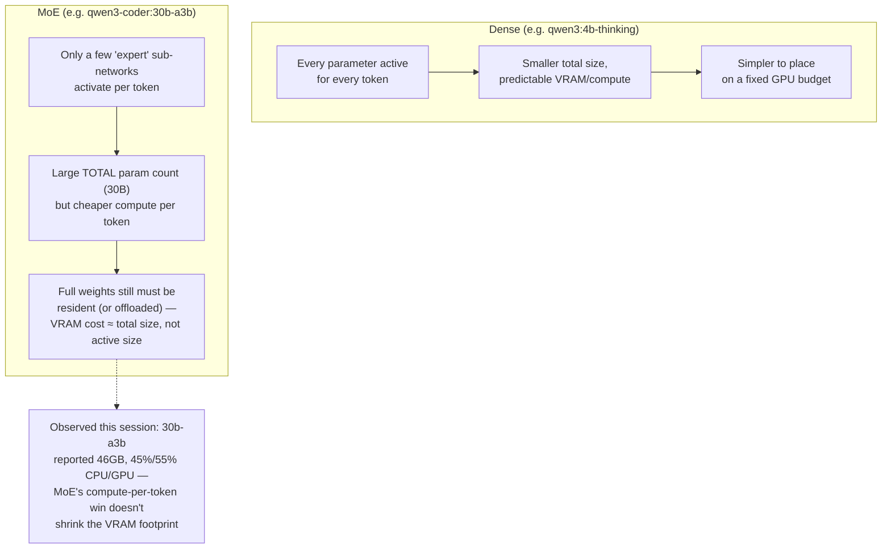

# 15 — MoE vs. Dense Model Tradeoffs

*Dark/neon render ([Graphviz](https://graphviz.org)): [SVG](graphviz/svg/15-moe-vs-dense.svg) · [PNG](graphviz/png/15-moe-vs-dense.png) · [DOT source](graphviz/15-moe-vs-dense.dot)*

`qwen3-coder:30b-a3b-q8_0` (used to test Qwen Code) is a Mixture-of-Experts
model — the `-a3b` suffix means ~3B active parameters per token despite
30B total. This diagram covers why that didn't translate into a small VRAM
footprint.

**The gotcha in one sentence:** MoE makes *inference compute* cheaper per
token, not *memory footprint* smaller — all experts have to be loadable
even though only a few fire per token, so don't reach for an MoE tag
expecting it to be VRAM-friendly just because its active-parameter count
sounds small.
