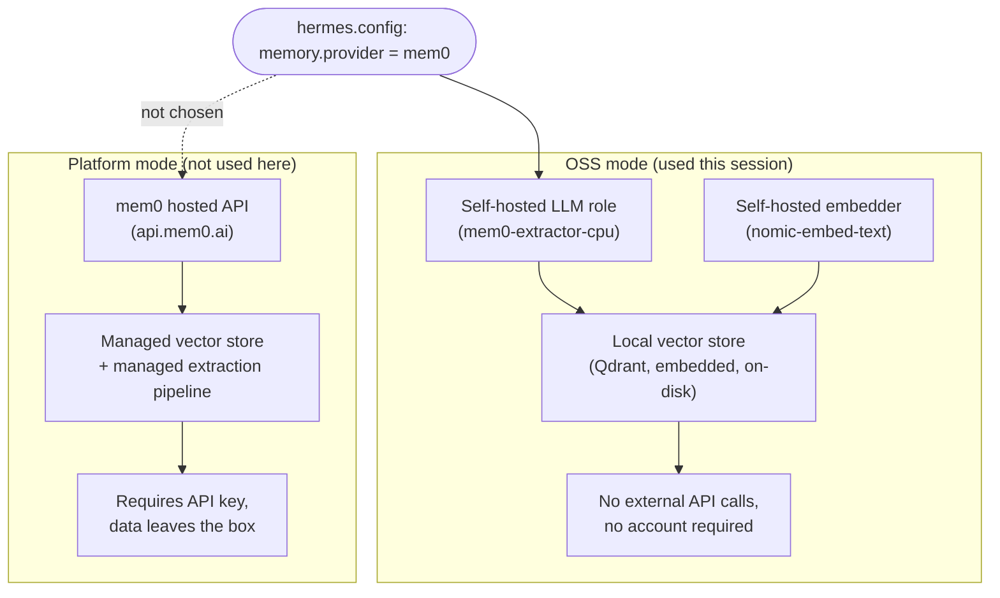

# 16 — mem0 Architecture: OSS vs. Platform Mode

*Dark/neon render ([Graphviz](https://graphviz.org)): [SVG](graphviz/svg/16-mem0-architecture.svg) · [PNG](graphviz/png/16-mem0-architecture.png) · [DOT source](graphviz/16-mem0-architecture.dot)*

[Diagram 05](../05-mem0-memory-pipeline.md) shows the OSS-mode pipeline this
session actually built and fixed. This diagram zooms out one level, to the
choice mem0 itself offers between running entirely local vs. using its
hosted platform — and why OSS mode was the right call here.

**Why OSS mode fit here:** the whole point of this stack is local-first
inference — routing memory extraction through a cloud API would undercut
that for a component that's arguably more sensitive than chat traffic
(memory persists). The tradeoff, documented in the main writeup, is that
you then own the resource-placement problem yourself (where does the
extraction model run, on what device) — which is exactly what the
`mem0-extractor-cpu` fix in [diagram 05](../05-mem0-memory-pipeline.md)
had to solve.
