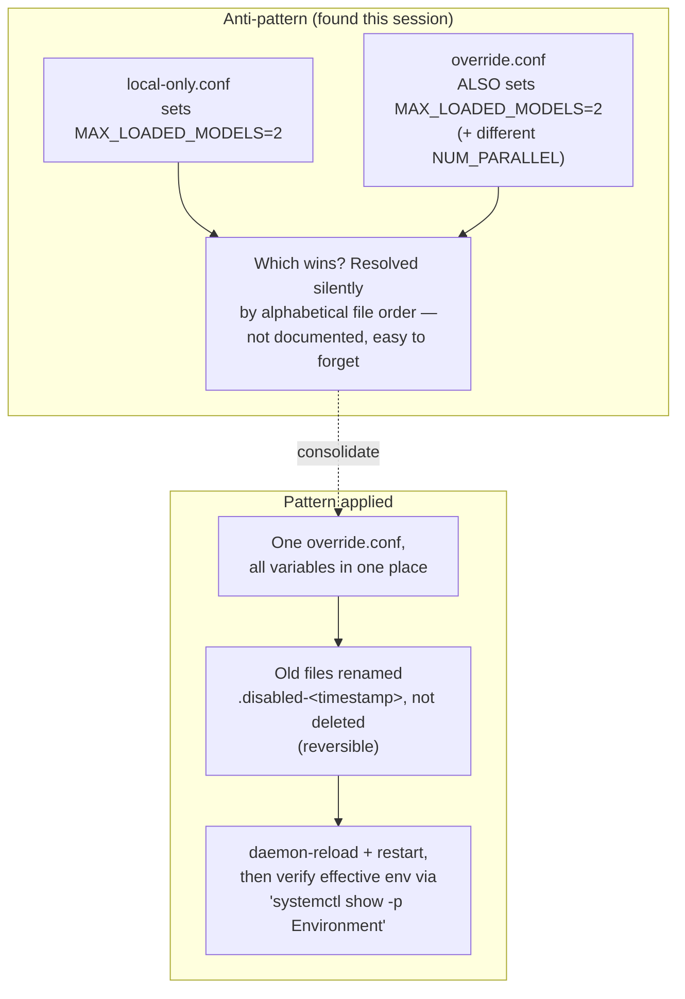

# 17 — systemd Drop-in Hardening Patterns

*Dark/neon render ([Graphviz](https://graphviz.org)): [SVG](graphviz/svg/17-systemd-hardening-patterns.svg) · [PNG](graphviz/png/17-systemd-hardening-patterns.png) · [DOT source](graphviz/17-systemd-hardening-patterns.dot)*

Generalized from the exact mess this session found in
`/etc/systemd/system/ollama.service.d/` and fixed — useful for any
systemd service with more than one drop-in file, not just Ollama.

**The general lesson:** systemd resolves multiple drop-ins for the same
key by file sort order, silently — no warning, no error, just "whichever
file sorts last for that key wins." That's fine as a mechanism but
terrible as an ambient assumption. If you have more than one `.conf` in a
`*.service.d/` directory, audit for overlapping keys before debugging
anything else.
