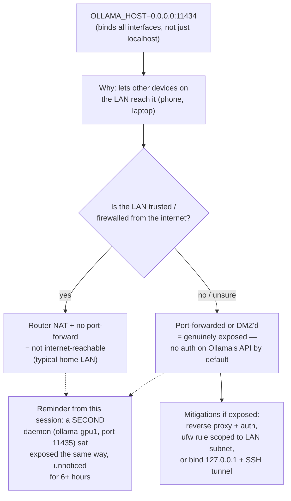

# 18 — LAN Exposure Security for Local LLM Daemons

*Dark/neon render ([Graphviz](https://graphviz.org)): [SVG](graphviz/svg/18-lan-exposure-security.svg) · [PNG](graphviz/png/18-lan-exposure-security.png) · [DOT source](graphviz/18-lan-exposure-security.dot)*

This session's Ollama config binds `0.0.0.0:11434` rather than `127.0.0.1`.
That's a deliberate, common choice for reaching a home-network local-LLM
box from other devices — but it's worth understanding what it actually
exposes, especially given [diagram 07](../07-catch22s.md)'s discovery of a
second daemon that had been running exposed and unnoticed for hours.

**Ollama has no built-in authentication.** Anyone who can reach the port
can load models, run inference, and consume your GPU/CPU — there's no API
key concept in the base daemon. On a home LAN behind NAT with no
port-forward, that's a low-severity, "someone on my own network could mess
with it" risk. The moment it's reachable from the wider internet, it's a
free-compute target. Either way: **periodically audit what's actually
listening** (`ss -tlnp`, `systemctl list-units`) — this session found a
forgotten second daemon on exactly this kind of config purely by accident.
