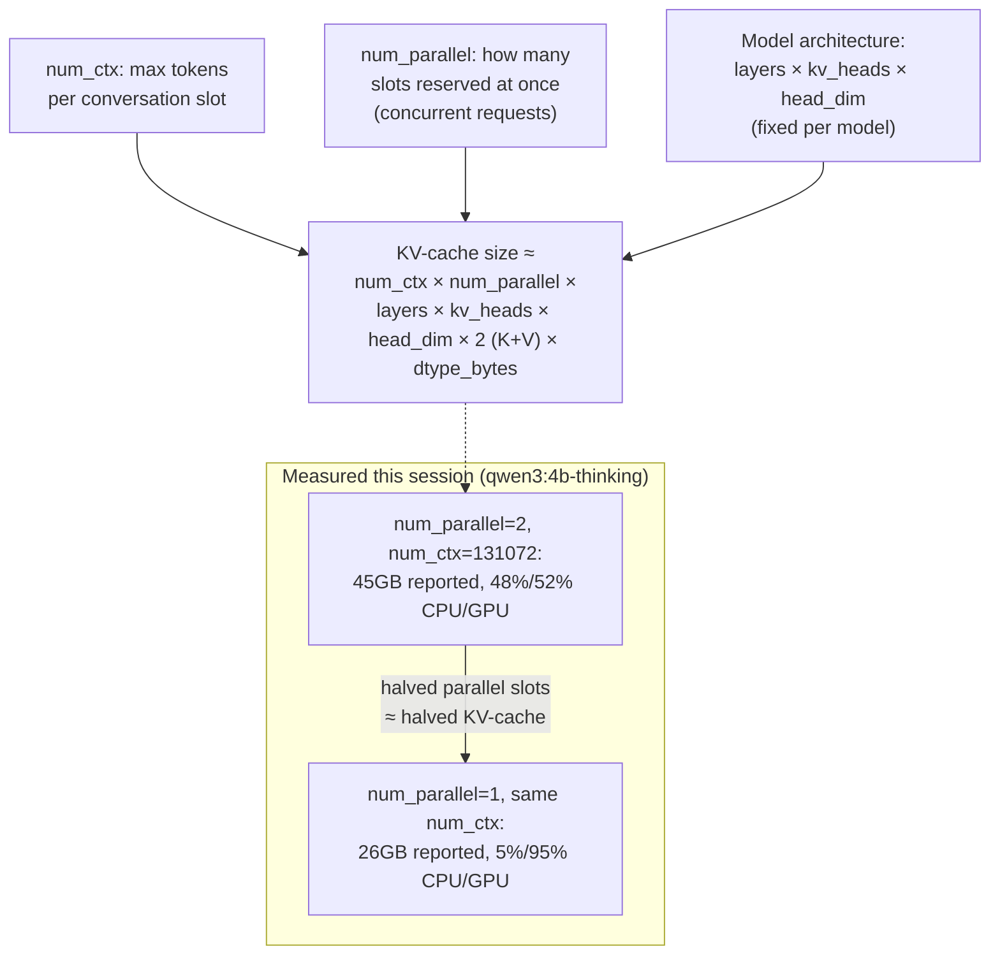

# 19 — Context Window / KV-Cache Math

*Dark/neon render ([Graphviz](https://graphviz.org)): [SVG](graphviz/svg/19-context-window-kv-cache-math.svg) · [PNG](graphviz/png/19-context-window-kv-cache-math.png) · [DOT source](graphviz/19-context-window-kv-cache-math.dot)*

The formula behind why `OLLAMA_NUM_PARALLEL` turned out to matter more
than `num_ctx` for VRAM in this session's biggest measured win — see
[diagram 04](../04-gpu-scheduling-before-after.md) for the headline numbers.

**The counterintuitive takeaway:** `num_parallel` is a straight *multiplier*
on KV-cache size — every additional concurrent slot reserves a full extra
copy of the cache, regardless of whether it's ever used. Trimming
`num_ctx` helps too, but linearly and only up to how much of that context
you actually need; trimming an *unused* parallel slot is close to free
performance. Check whether your workload is actually concurrent before
paying for slots you don't need.
