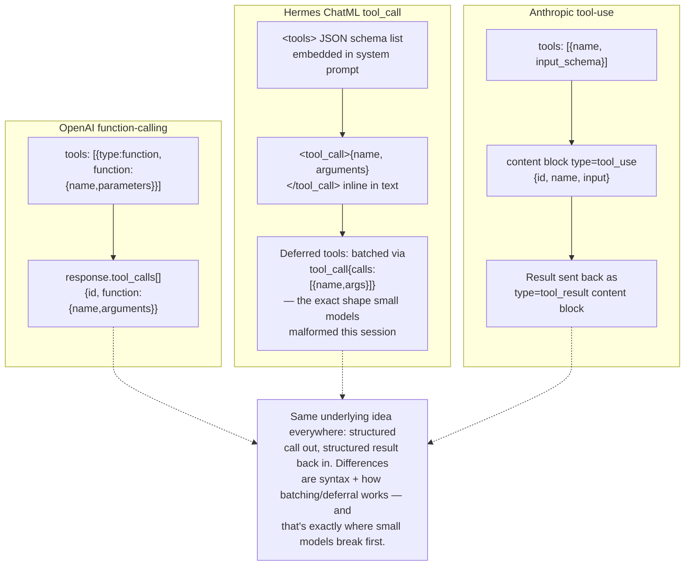

# 20 — Tool-Calling Protocol Comparison

*Dark/neon render ([Graphviz](https://graphviz.org)): [SVG](graphviz/svg/20-tool-calling-protocol-comparison.svg) · [PNG](graphviz/png/20-tool-calling-protocol-comparison.png) · [DOT source](graphviz/20-tool-calling-protocol-comparison.dot)*

Three real tool-calling wire formats, side by side — not an opinion piece,
just the shapes. [Diagram 08](../08-tool-calling-bridge-fix.md) documents
exactly where the Hermes variant's extra batching layer broke down with
small local models this session.

**Why this matters beyond trivia:** every one of these protocols asks the
model to emit *exact* structured syntax with zero tolerance for drift. A
model that's otherwise perfectly capable at reasoning can still fail an
agentic task purely on protocol fidelity — which is precisely what
happened this session, twice, with two different small models on two
different failure shapes (a missing-thinking-support hard error, and a
malformed batch array).
