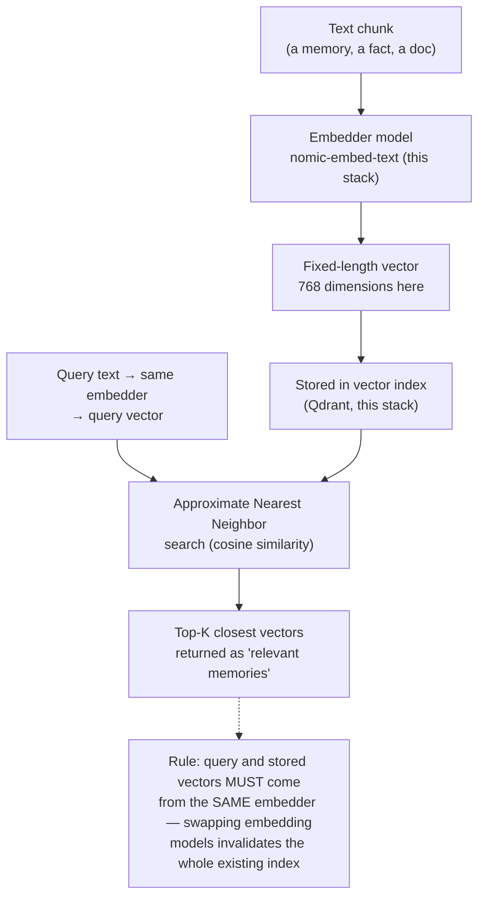

# 21 — Embeddings & Vector Search Fundamentals

*Dark/neon render ([Graphviz](https://graphviz.org)): [SVG](graphviz/svg/21-embeddings-vector-search.svg) · [PNG](graphviz/png/21-embeddings-vector-search.png) · [DOT source](graphviz/21-embeddings-vector-search.dot)*

`nomic-embed-text` shows up throughout this repo as "the small GPU model"
without much explanation of what it's actually doing. This is that
explanation, generalized beyond this specific stack.

**Why this rule matters in practice:** if you ever change `mem0.json`'s
embedder (say, to a different-dimension model), every memory written under
the old embedder becomes unsearchable — not corrupted, just geometrically
incomparable to new query vectors. Re-embedding the whole store is the only
fix, which is worth knowing *before* you casually swap an embedder model.
