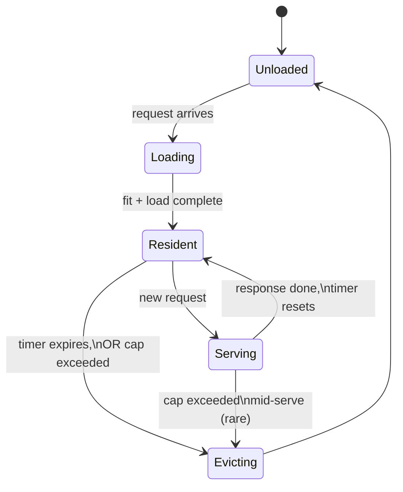

# 22 — Model Lifecycle & Keep-Alive State Machine

*Dark/neon render ([Graphviz](https://graphviz.org)): [SVG](graphviz/svg/22-model-lifecycle-keepalive.svg) · [PNG](graphviz/png/22-model-lifecycle-keepalive.png) · [DOT source](graphviz/22-model-lifecycle-keepalive.dot)*

[Diagram 13](13-ollama-scheduler-internals.md) covers what happens *during*
a load. This is the bigger picture — every state a model tag cycles
through from cold to evicted, and exactly which events move it between
them. The `journalctl` lines quoted in the main writeup's evidence sections
are log statements emitted at these exact transitions.

**The knob that matters most:** `OLLAMA_KEEP_ALIVE` (default `5m`) controls
how long the idle timer runs in the `Resident` state before eviction. Set
it too low and you pay reload cost constantly; too high and idle models
hog VRAM other work needs. This session never touched that value directly
— the actual fix was reducing *how many* models compete for the cap, not
how long any one of them lingers.
