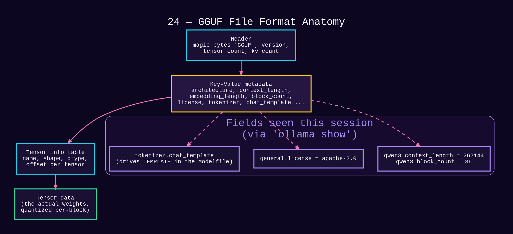
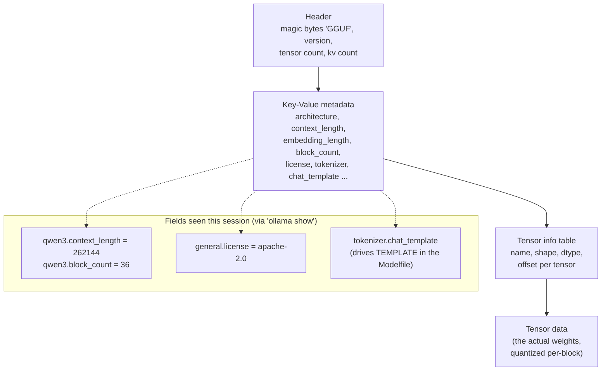

# 24 — GGUF File Format Anatomy

*Dark/neon render ([Graphviz](https://graphviz.org)): [SVG](graphviz/svg/24-gguf-file-anatomy.svg) · [PNG](graphviz/png/24-gguf-file-anatomy.png) · [DOT source](graphviz/24-gguf-file-anatomy.dot)*

`ollama show <model>` output quoted throughout this repo (`qwen3.context_length`,
`general.license`, etc.) is reading straight out of a GGUF file's key-value
metadata block. This is what's actually inside that file, one layer below
the Modelfile in [diagram 23](23-modelfile-anatomy.md).

**Why GGUF specifically, and not raw PyTorch/safetensors:** the KV-metadata
block is self-describing — a runtime like `llama.cpp`/Ollama can read
`context_length`, `block_count`, and the chat template straight from the
file with no external config needed. That's exactly the mechanism behind
`ollama show` printing accurate specs for models this session never wrote
any config for.
