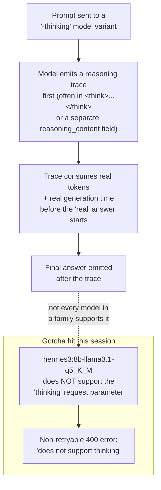

# 25 — Reasoning ("Thinking") Models Explained

*Dark/neon render ([Graphviz](https://graphviz.org)): [SVG](graphviz/svg/25-thinking-models-explained.svg) · [PNG](graphviz/png/25-thinking-models-explained.png) · [DOT source](graphviz/25-thinking-models-explained.dot)*

`qwen3:4b-thinking-2507-q8_0` was this session's daily driver for a long
stretch. This is what the "-thinking" actually means, and the exact hard
error a *different* model in the rotation hit for not supporting it.

**The practical takeaway:** "thinking" isn't a universal on/off toggle a
harness can safely request from any model — it's a capability specific to
how a given checkpoint was trained and how its chat template is written.
Requesting it from a model that doesn't support it isn't a graceful
degradation, it's a hard 400 error, which is exactly what forced this
session off `hermes3:8b-q5_K_M` mid-stream.
