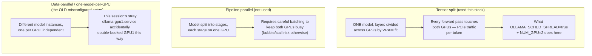

# 26 — Multi-GPU Parallelism Strategies

*Dark/neon render ([Graphviz](https://graphviz.org)): [SVG](graphviz/svg/26-multi-gpu-parallelism-strategies.svg) · [PNG](graphviz/png/26-multi-gpu-parallelism-strategies.png) · [DOT source](graphviz/26-multi-gpu-parallelism-strategies.dot)*

Three genuinely different ways to spread work across more than one GPU —
this stack uses the first, and this session's stray daemon accidentally
demonstrated a broken version of the third.

**Why tensor-split, specifically, here:** it's the natural fit for "one
model bigger than either GPU alone" — the actual situation this box is in
with 16GB+12GB across two cards. Pipeline parallelism would need explicit
batching logic Ollama doesn't implement for single-request serving, and
data-parallel (independent model copies) only makes sense with genuinely
separate daemons — which is exactly the mistake the stray `ollama-gpu1`
daemon represented, not a real strategy anyone chose on purpose.
