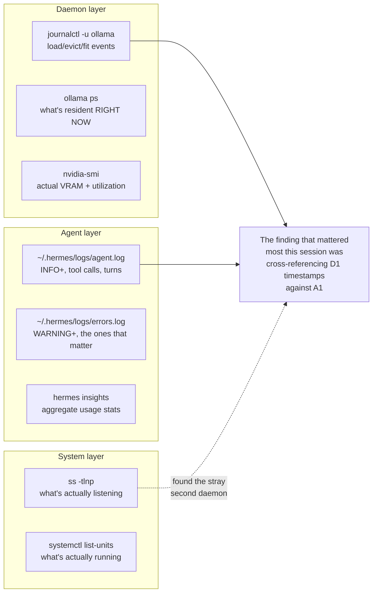

# 27 — Local LLM Observability Practices

*Dark/neon render ([Graphviz](https://graphviz.org)): [SVG](graphviz/svg/27-observability-practices.svg) · [PNG](graphviz/png/27-observability-practices.png) · [DOT source](graphviz/27-observability-practices.dot)*

Every diagnosis in the main writeup came from one of these three layers.
This is the general map — worth keeping as a checklist independent of the
specific bugs this session hit.

**The habit worth adopting:** none of these three layers alone would have
found the eviction-thrashing root cause. It took the daemon layer's
eviction timestamps lined up against the agent layer's memory-shutdown
log lines to actually prove causation instead of correlation — and it took
the system layer, almost as an afterthought, to find a completely
unrelated stray daemon nobody was looking for.
