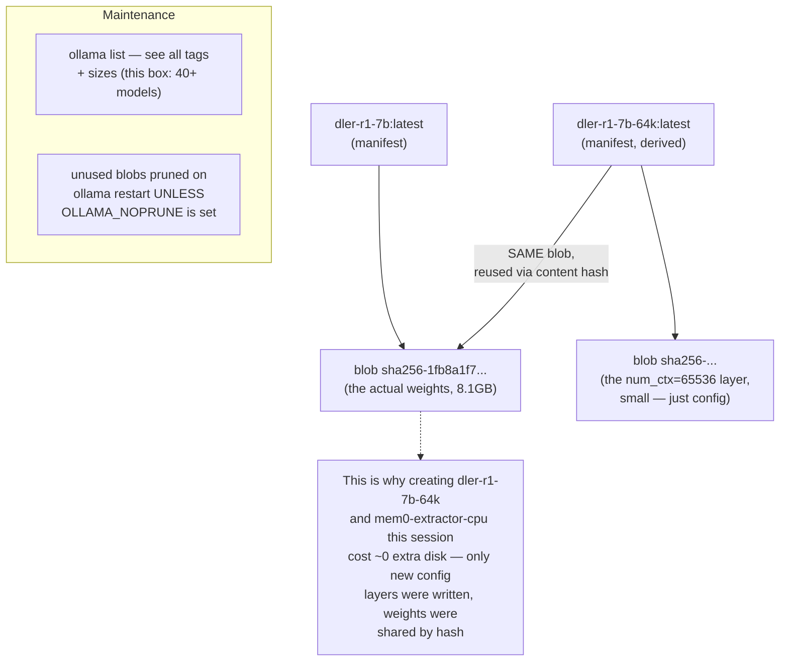

# 28 — Model Storage & Blob Deduplication

*Dark/neon render ([Graphviz](https://graphviz.org)): [SVG](graphviz/svg/28-model-storage-layout.svg) · [PNG](graphviz/png/28-model-storage-layout.png) · [DOT source](graphviz/28-model-storage-layout.dot)*

Two derived tags got created this session (`dler-r1-7b-64k`,
`mem0-extractor-cpu`). Neither one duplicated multi-gigabyte weight files
on disk — this is why.

**Why this matters for a box with 40+ pulled tags:** Ollama's manifest/blob
split (content-addressed by sha256, same as Docker/OCI images) means
"derive a variant" is nearly free as long as you're only changing
Modelfile *parameters* — the moment you change the base weights themselves,
you're pulling a genuinely new multi-gigabyte blob, which is the real
disk-cost line to watch when experimenting with model tags.
