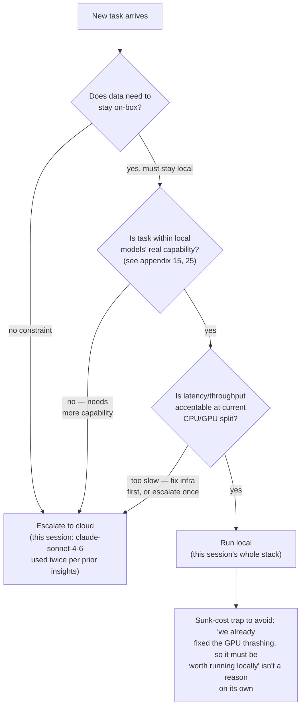

# 29 — Local vs. Cloud Inference: Decision Framework

*Dark/neon render ([Graphviz](https://graphviz.org)): [SVG](graphviz/svg/29-local-vs-cloud-decision.svg) · [PNG](graphviz/png/29-local-vs-cloud-decision.png) · [DOT source](graphviz/29-local-vs-cloud-decision.dot)*

This whole repo is about making local inference work *well*. It's still
worth having an honest framework for when local is the wrong call —
this session's own usage history includes real escalations to cloud.

**Why this framework, not a blanket rule:** this repo just spent 20+
diagrams making the case for careful local infra work, which makes it easy
to slide into treating "run it locally" as the goal rather than a means.
The actual goal is getting the task done well — data locality and genuine
capability fit are real reasons to stay local; having already sunk effort
into the GPU scheduler is not.
