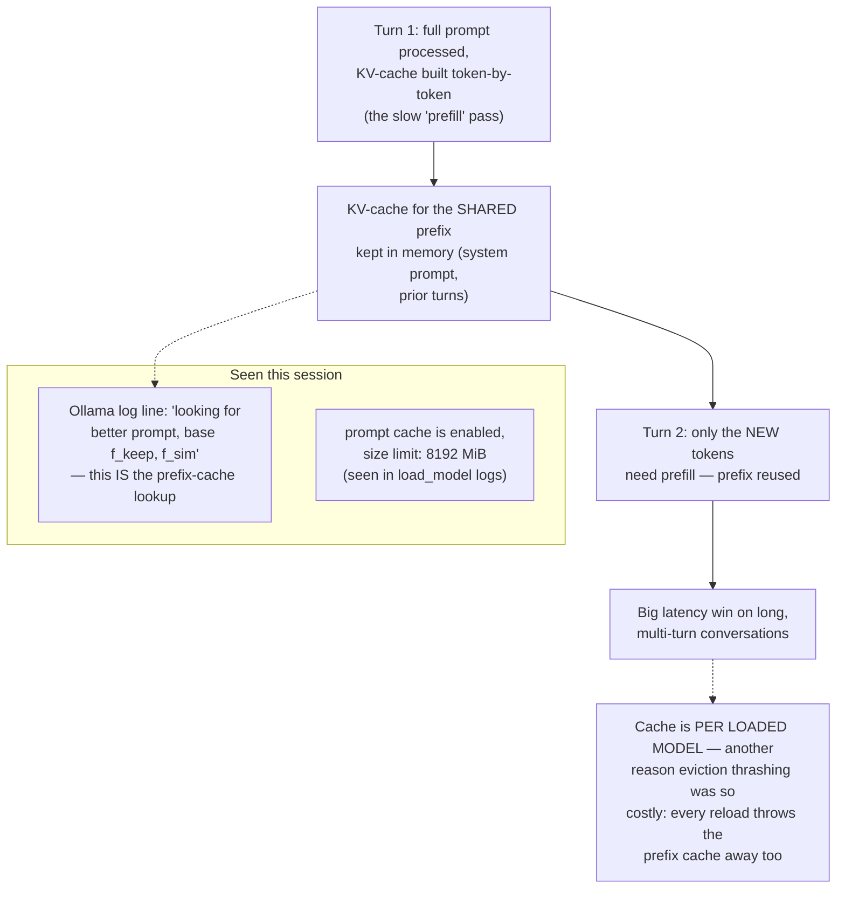

# 30 — Prompt / Context Caching Mechanics

*Dark/neon render ([Graphviz](https://graphviz.org)): [SVG](graphviz/svg/30-prompt-context-caching.svg) · [PNG](graphviz/png/30-prompt-context-caching.png) · [DOT source](graphviz/30-prompt-context-caching.dot)*

The very first `journalctl` snippet in [diagram 13](13-ollama-scheduler-internals.md)'s
source material contains a log line about "looking for better prompt" that
this diagram finally explains — and it ties directly back into why the
eviction thrashing documented in the main writeup was worse than it looked.

**The compounding cost this explains:** the 313 nemotron evictions in 3
hours weren't just paying the multi-gigabyte reload cost documented in the
main writeup — every one of those reloads also threw away whatever prefix
cache had built up, meaning the *next* request after a reload paid full
prefill cost too. The eviction number alone undersold how bad the
thrashing actually was.
